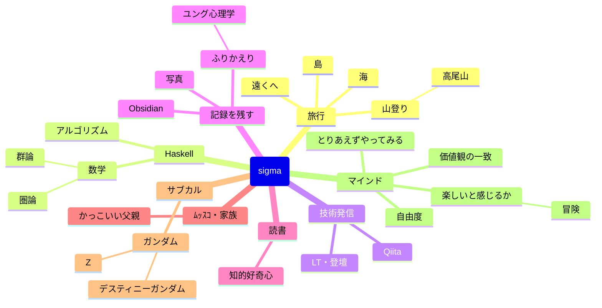

DDDの業務領域のカテゴライズの考え方が参考にできそう

- 自分にしかできない度合い(競合との差別化)
- 自分のモチベーションの高さ(業務ロジックの複雑さ)

```mermaid
mindmap
root(sigma)
  旅行
    海
    島
    遠くへ
    山登り
      高尾山
  Haskell
    数学
      圏論
      群論
    アルゴリズム
  技術発信
    Qiita
    LT・登壇
  記録を残す
    ふりかえり
      ユング心理学
    Obsidian
    写真
  読書
    知的好奇心
  ﾑｯｽｺ・家族
    かっこいい父親
  サブカル
    ガンダム
      デスティニーガンダム
      Z
  マインド
    とりあえずやってみる
    楽しいと感じるか
      冒険
    価値観の一致
    自由度
```
