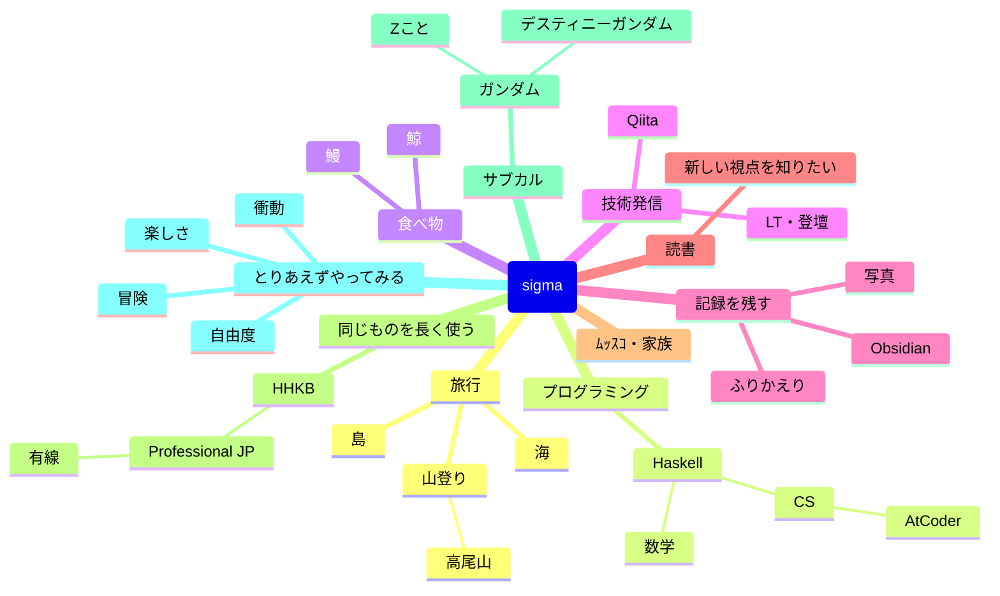

```mermaid
mindmap
root(sigma)
  旅行
    海
    島
    山登り
      高尾山
  プログラミング
    Haskell
      数学
      CS
        AtCoder
  食べ物
    鰻
    鯨
  技術発信
    Qiita
    LT・登壇
  記録を残す
    ふりかえり
    Obsidian
    写真
  読書
    新しい視点を知りたい
  ﾑｯｽｺ・家族
  同じものを長く使う
    HHKB
      Professional JP
       有線
  サブカル
    ガンダム
      デスティニーガンダム
      Zこと
  とりあえずやってみる
    衝動
    楽しさ
    自由度
    冒険
```
